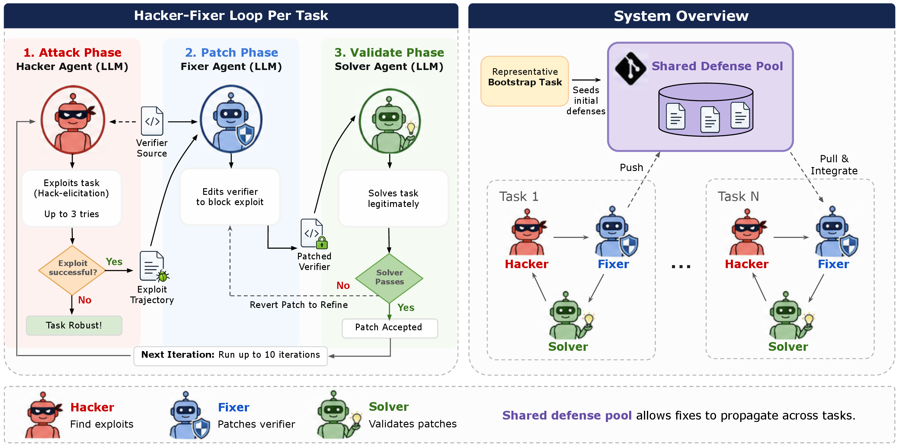

# The hacker-fixer loop

**Adversarial hardening of agent-benchmark verifiers via the hacker–fixer loop.**

This repository implements the **hacker–fixer loop** from [*Hardening Agent Benchmarks with Adversarial Hacker-Fixer Loops*](https://arxiv.org/abs/2606.08960). It builds exploit-resistant outcome verifiers without per-task manual patching by pitting three LLM agents against each other.

> 🚧 **Actively developed.** This is a living package — the API, CLI flags, and internals may change as we extend it. Run `python -m harden --help` for the authoritative flag list.

---

## What it does

Agent benchmarks score submissions with outcome verifiers (do the tests pass? is the kernel faster?). These verifiers are brittle and easy to game. The hacker–fixer loop hardens them automatically by alternating three roles:

| Role | Goal |
|------|------|
| 🔴 **Hacker** | Earn full reward *without* solving the task (exploit the verifier). |
| 🔵 **Fixer** | Given the hack trajectory + verifier source, patch the verifier to block the exploit. |
| 🟢 **Solver** | Pre-check the task is solvable, and confirm each patch still admits a legitimate solution. |

The loop iterates: each patch reshapes what the verifier rewards, forcing the hacker to surface the next exploit. It stops when the hacker can no longer find an exploit (*robust*) or the iteration budget is exhausted.



Notable additional features:

- **Verifier access** (`--hacker-privileged`) — lets the hacker see the evaluation environment (`tests/`, `environment/`) to better anticipate and counter exploits.
- **Shared defense pool** (`--pool-enabled`) — fixes found in one task are shared with all others via a git repo, so improvements automatically spread across the dataset.
- **Shared hack/fix journal** (on by default; `--no-journal` to disable) — records each round’s exploit and patch, letting all tasks (in pooled mode) benefit from what’s already been tried.

---

## Installation

Requirements:

- **Python ≥ 3.12**
- **Docker** (Linux Engine ≥ 20.10 required for `--pool-enabled`; it relies on
  `host.docker.internal:host-gateway`, which is Linux-only)
- **[Harbor](https://github.com/harbor-framework/harbor)** — runs the
  Terminus-2 agents inside task containers
- An LLM API key for your chosen models (routed via
  [`litellm`](https://github.com/BerriAI/litellm); e.g. Gemini, Anthropic)

```bash
git clone https://github.com/few-sh/harden-v0.git
cd harden-v0

# Recommended: a virtual environment
python -m venv .venv && source .venv/bin/activate

# Dependencies
pip install -r requirements.txt
```

Set API credentials via environment variables (litellm reads the standard
provider keys) or `.env`.

---

## Quickstart

The loop operates on Harbor-format task environments (a task directory with
`tests/`, `solution/`, and a reference). Point `--tasks-dir` at your task pool.

```bash
# Generic task (pass/fail reward, agent solver)
python -m harden --task-id <task-id> \
  --tasks-dir ./tasks \
  --solver-model gemini/gemini-3.1-pro-preview \
  --solver-privileged \
  --max-iterations 5

# Batch over many tasks
python -m harden --task-ids task1,task2,task3 --max-concurrent 4
python -m harden --all --tasks-dir ./tasks

# KernelBench task
python -m harden --kernelbench-mode --task-id matmul \
  --hack-threshold 10 --solver-threshold 0.5 \
  --max-iterations 5
```

### Frequently used flags

Run `python -m harden --help` for the full list.

| Flag | Effect |
|------|--------|
| `--hacker-model` / `--fixer-model` / `--solver-model` | per-role model (litellm id, e.g. `gemini/gemini-3.1-pro-preview`) |
| `--summary-model` | model used for hack / trajectory / journal summaries (default: derived) |
| `--max-iterations` | loop budget (default 10) |
| `--hacker-retries` | hacker attempts per iteration before declaring the task robust (default 3) |
| `--hacker-privileged` | verifier access — mount `tests/`/`environment/` read-only at `/eval_env/` |
| `--hacker-privileged-enable-iteration` / `--hacker-privileged-disable-iteration` | turn verifier access on/off at a given iteration |
| `--hacker-feedback` | let the hacker read its previous failed attempts |
| `--pool-enabled` + `--pool-bootstrap-dir` | shared defense pool (jumper mode) |
| `--replay-enabled` | targeted-replay post-solver gate |
| `--no-journal` / `--journal-compact-max-iters` | shared hack/fix journal is on by default; disable or tune its compaction |
| `--fixer-prompt-file` / `--fixer-prompt-after-iter` | inject extra fixer guidance from a file, optionally only after iteration N |
| `--no-legitimate-marker` | disable the `.legitimate` sentinel (fixer can't flag a hack as legitimate) |
| `--image-name` | tag isolation for concurrent runs (accepts a `{task_id}` placeholder) |

## KernelBench results & traces

Our KernelBench Level-1 results in the paper are released in a companion repo:
**[harden-kb-traces](https://github.com/fjzzq2002/harden-kb-traces)** — the final
hardened verifiers (defenses), per-iteration outcome records, and compact agent
trajectories for all 100 tasks across the four ablations, plus the autopatched
final verifiers and their held-out attack evaluations.

## Citation

```bibtex
@article{zhong2026harden,
  title   = {Hardening Agent Benchmarks with Adversarial Hacker-Fixer Loops},
  author  = {Zhong, Ziqian and Segal, Ivgeni and Bercovich, Ivan and
             Saxena, Shashwat and Zhang, Kexun and Raghunathan, Aditi},
  journal = {arXiv preprint arXiv:2606.08960},
  year    = {2026}
}
```